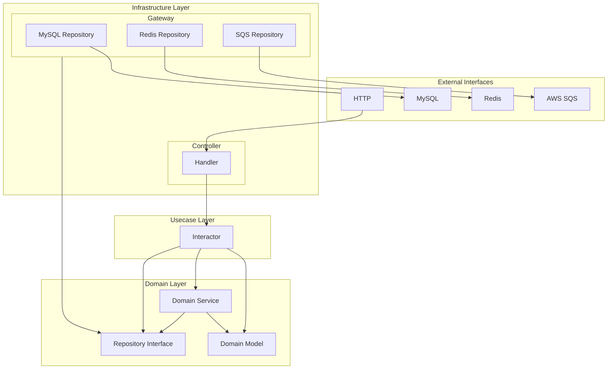

# go-clean-architecture-boilerplate

## Architecture Overview

This boilerplate is built on the Clean Architecture.
It puts the business logic at the center and protects it from the details of external implementations, resulting in testable and maintainable code.


### Layer Structure



### Dependency Rules

1. Dependencies always point inwards
   - Infrastructure → Usecase → Domain
   - Outer layers know about inner layers
   - Inner layers don't know about outer layers

2. Dependency Inversion Principle
   - Repository interfaces are defined in the domain layer
   - Implementations are provided in the infrastructure layer

### Layer Mapping to Directory

1. **Domain Layer** (`internal/domain`) - Innermost layer
   - Defines pure business logic independent of external implementations
   - `domain/model`: Core domain logic and business rules and structures
   - `domain/repository`: Interfaces defining operations on domain models
   - `domain/service`: Contains multiple domain logic and business rules

2. **Usecase Layer** (`internal/usecase`) - Middle layer
   - Implements application-specific use cases
   - Transaction management
   - `usecase/interactor`: Implements business logic that operates on domain models
   - `usecase/port`: Defines input and output ports

3. **Infrastructure Layer** (`internal/infrastructure`) - Outermost layer
   - Concrete implementations of interfaces with external systems, frameworks, and databases
   - Implements transaction management in repositories
   - Provides adapters for format conversion
   - Error handling and logging implementation
   - `infrastructure/cmd`: Implements routing from entry points to controllers based on commands
   - `infrastructure/controller`: Implements HTTP servers, gRPC servers, commands, and subscribers
   - `infrastructure/gateway`: Connects to external systems (MySQL, Redis)

## Directory Structure Overview

```sh
├── internal
│   ├── domain
│   │   ├── model
│   │   ├── repository
│   │   └── service
│   │
│   ├── usecase
│   │   ├── interactor
│   │   └── port
│   │
│   ├── infrastructure
│   │   ├── cmd
│   │   │   ├── http
│   │   │   ├── subscriber
│   │   │   └── task
│   │   │
│   │   ├── controller
│   │   │   ├── http
│   │   │   ├── subscriber
│   │   │   └── task
│   │   │
│   │   ├── gateway
│   │   │   ├── mysql
│   │   │   └── redis
│   │   │
│   │   └── environment
│   │
│   └── dependency
│
└── pkg
```

## Technology Stack

| Category | Component | Details |
|----------|-----------|----------|
| **Backend** | Architecture | Clean Architecture |
| | Language | [Go](https://github.com/golang/go) |
| | Framework | • [Chi](https://github.com/go-chi/chi) (HTTP router and dispatcher)<br>• [Cobra](https://github.com/spf13/cobra) (Command-line framework) |
| | API Documentation | [OpenAPI](https://github.com/OAI/OpenAPI-Specification) |
| **Database & Caching** | Database | [MySQL](https://dev.mysql.com/) |
| | Cache | [Redis](https://redis.io/) |
| | ORM | [sqlc](https://github.com/sqlc-dev/sqlc) |
| **Infrastructure & Cloud** | Container | [Docker](https://www.docker.com/) |
| | Message Queue | [AWS SQS](https://aws.amazon.com/sqs/) |
| | CI/CD | [GitHub Actions](https://github.com/features/actions) |
| **Tools** | Documentation Generator | [swag](https://github.com/swaggo/swag) |

## Development Flow

1. Define Domain Model

2. Define Repository Interface

3. Define Usecase

4. Define Schema & Query

5. Generate sqlc code

6. Implement Repository

7. Implement Handler or Command

## Code Generation

### swag

1. Define controller

   Put controller files in the `internal/infrastructure/controller/http/handler` directory.
   Example: `user.go`, `matching.go`, etc.

2. Annotate controller

   Add comments to the controller files to generate OpenAPI documentation.
   Example: `user.go`, `matching.go`, etc.

3. Generate OpenAPI documentation

   ```sh
   make swag-gen
   ```

### sqlc

1. Define schema

   Put schema files in the `internal/infrastructure/gateway/mysql/sqlc/schema/` directory.
   Example: `001_user.sql`, `002_matching.sql`, etc.

2. Define query
   Put query files in the `internal/infrastructure/gateway/mysql/sqlc/query/` directory.
   Example: `user.sql`, `matching.sql`, etc.

3. Generate code
   Run the following command to generate code.

   ```sh
   make sqlc-gen
   ```

4. Define repository interface & implement repository
   - Define repository interface in the `domain/repository` directory.
   - Implement the repository in the `infrastructure/gateway/mysql/repository` directory.
