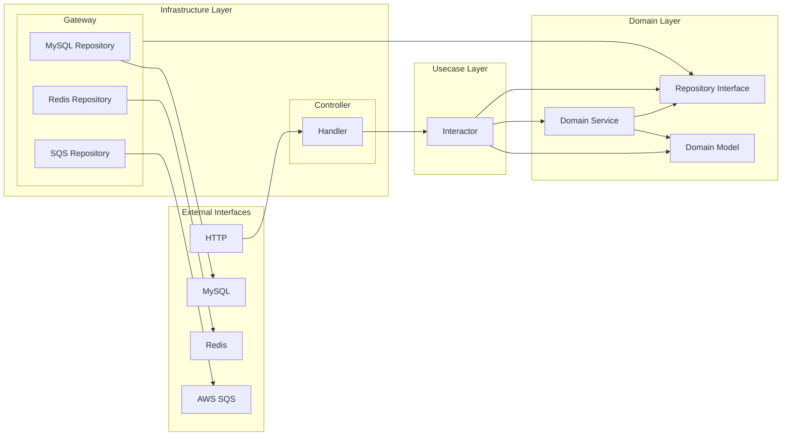

# go-clean-architecture-boilerplate

## Architecture Overview

This boilerplate is built on the Clean Architecture.
It puts the business logic at the center and protects it from the details of external implementations, resulting in testable and maintainable code.


### Layer Structure



### Dependency Rules

1. Dependencies always point inwards
   - Infrastructure → Usecase → Domain
   - Outer layers know about inner layers
   - Inner layers don't know about outer layers

2. Dependency Inversion Principle
   - Repository interfaces are defined in the domain layer
   - Implementations are provided in the infrastructure layer

### Layer Mapping to Directory

1. **Domain Layer** (`internal/domain`) - Innermost layer
   - Defines pure business logic independent of external implementations
   - `domain/model`: Core business entities and rules
   - `domain/repository`: Interfaces defining operations on domain models

2. **Usecase Layer** (`internal/usecase`) - Middle layer
   - Implements application-specific use cases
   - Ensuring the integrity of the data store, such as DB transaction management, is also the responsibility of this layer.
   - `usecase/interactor`: Implements business logic that operates on domain models
   - `usecase/port`: Defines input and output ports

3. **Infrastructure Layer** (`internal/infrastructure`) - Outermost layer
   - Concrete implementations of interfaces with external systems, frameworks, and databases
   - `infrastructure/cmd`: Implements routing from entry points to controllers based on commands
   - `infrastructure/controller`: Implements HTTP servers, gRPC servers, commands, and subscribers
   - `infrastructure/gateway`: Connects to external systems (MySQL, Redis)

## Directory Structure Overview

```sh
├── internal
│   ├── domain
│   │   ├── model
│   │   └── repository
│   │
│   ├── usecase
│   │   ├── interactor
│   │   └── port
│   │       ├── input
│   │       └── output
│   │
│   ├── infrastructure
│   │   ├── cmd
│   │   │   ├── http
│   │   │   ├── subscriber
│   │   │   └── task
│   │   │
│   │   ├── controller
│   │   │   ├── http
│   │   │   ├── subscriber
│   │   │   └── task
│   │   │
│   │   ├── gateway
│   │   │   ├── mysql
│   │   │   └── redis
│   │   │
│   │   └── environment
│   │
│   └── dependency
│
└── pkg
```

## Technology Stack

| Category | Component | Details |
|----------|-----------|----------|
| **Backend** | Architecture | Clean Architecture |
| | Language | Go |
| | Framework | • Chi (HTTP router and dispatcher)<br>• Cobra (Command-line framework) |
| | Documentation | OpenAPI (API documentation) |
| **Database & Caching** | PDatabase | MySQL 8.0 |
| | Cache | Redis |
| | ORM | database/sql |
| **Infrastructure & Cloud** | Container | Docker |
| | Message Queue | AWS SQS |
| | CI/CD | GitHub Actions |
| **Tools** | Documentation Generator | Swag (Generate OpenAPI documentation) |
